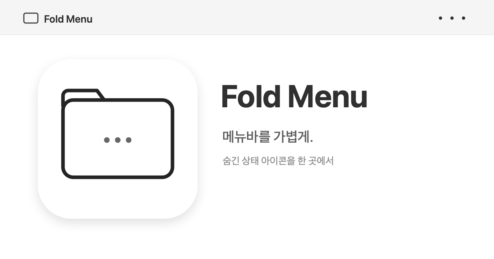

# Fold Menu



macOS 메뉴바 항목을 한 폴더에서 펼쳐 쓰는 네이티브 프로토타입입니다.

## 개발자 설치

macOS 14 이상과 Xcode Command Line Tools가 필요합니다. 설치용 앱 ZIP이나 GitHub Release는 제공하지 않으며, 저장소를 복제해 직접 빌드합니다.

```sh
git clone https://github.com/jaymunsh/fold-menu.git
cd fold-menu
bash scripts/build.sh
open "dist/Fold Menu.app"
```

처음 실행할 때 시스템 설정 → 개인정보 보호 및 보안 → 손쉬운 사용에서 Fold Menu를 허용해야 다른 앱의 메뉴바 항목을 읽고 열 수 있습니다. 실제 상태 아이콘을 복제하려면 화면 기록 권한도 필요합니다.

## 편집 방식

폴더에 넣고 빼는 편집은 사용자가 직접 합니다. 폴더에서 앱을 사용할 때만 해당 아이콘 하나를 잠깐 꺼냈다가 되돌립니다.

1. 설정에서 **항목 편집 시작**을 누릅니다.
2. `⌘` 키를 누른 채 메뉴바 아이콘을 수평으로 옮깁니다.
3. 폴더 왼쪽은 폴더 안에 접을 항목, 오른쪽은 계속 표시할 항목입니다.
4. **편집 완료하고 접기**를 누릅니다.

아이콘을 메뉴바 아래로 끌면 macOS가 해당 항목을 메뉴바에서 제거할 수 있습니다. Fold Menu는 이 동작을 대신 수행하지 않으며, 체크박스로 다른 앱 아이콘을 이동시키지도 않습니다.

## 현재 구현

- 메뉴바에는 보이는 Fold Menu 폴더 아이콘 하나만 둡니다.
- 모니터마다 보이는 폴더 아이콘은 해당 화면의 메뉴바 활성 상태에 맞춰 진하거나 옅게 표시합니다. 비활성 화면에서도 클릭할 수 있습니다.
- 닫힌 폴더 모양 안에 현재 항목 수를 표시합니다. 비어 있으면 `0`, 100개 이상이면 `99+`이며 툴팁에는 정확한 개수가 나옵니다. 상태창 변화는 약 5초 안에 감지하고, 변화가 감지되지 않아도 최대 약 15초 안에 다시 검색합니다.
- 접을 때 폴더 왼쪽 영역을 보이지 않게 하고, 폴더를 누르면 저장된 실제 상태 아이콘을 가로 패널에 표시합니다.
- 패널의 아이콘을 누르면 해당 항목 하나만 폴더 바로 오른쪽에 잠시 꺼내 실제 메뉴를 클릭하고, 메뉴가 닫힌 뒤 원래 이웃 또는 폴더 경계 앞으로 되돌립니다. 꺼낸 위치가 폴더에 붙었는지도 실제 창 좌표로 확인합니다.
- 지원되는 앱은 접근성의 누르기 동작으로 메뉴를 열어 추가 포인터 클릭을 생략합니다. 지원하지 않는 앱만 기존 클릭 방식을 사용합니다. 아이콘을 잠시 꺼내는 동작 자체는 남아 있습니다.
- 짧은 자동 입력 중에는 포인터를 보호하고, 끝나면 사용자의 실제 이동량을 반영해 복원합니다. 메뉴를 사용하는 동안에는 포인터를 제어하지 않습니다.
- 메뉴 사용 중 폴더를 다시 열면 상태와 **대기 취소**가 표시됩니다. 취소한 항목은 메뉴를 닫은 뒤 **꺼낸 항목 되돌리기**로 복구할 수 있습니다. 복귀 정보는 앱 재실행 후에도 유지됩니다.
- 설정의 **완료** 또는 닫기 버튼으로 편집을 끝내면 현재 배치를 읽어 다시 접습니다.
- 위치를 확인하지 못해 안전하게 펼쳐진 경우에는 폴더/설정의 **다시 접기**로 재시도할 수 있습니다. 편집 모드나 아이콘 재배치 없이 기존 선택을 유지합니다.
- 메뉴바 상태창이 바뀌면 다음 5초 검사에서 새 항목을 검색합니다. 변화가 감지되지 않는 경우도 놓치지 않도록 마지막 검색 후 10초가 지나면 다음 5초 검사에서 전체 검색합니다. 아이콘 그림은 캡처한 스냅샷이며, 매 검색마다 화면을 재캡처하지 않습니다.
- 종료할 때는 숨긴 영역을 먼저 펼칩니다.
- 처음 실행하거나 선택이 비어 있으면 임의로 접지 않습니다.
- macOS 26.6.2에서 Docker Desktop·HoldImg·donts3p의 메뉴 열기와 복귀를 실기 검증했습니다. macOS 27은 별도 검증 전입니다.

## 검증

```sh
bash scripts/test.sh
bash scripts/build.sh
```

초기 설계부터 기술 구성·문제 해결·남은 제약까지는 [설계·개발 기록](docs/project-history-and-architecture.md)에, 실행별 결과와 실기 검증 상태는 [검증 기록](docs/verification.md)에 정리했습니다. 메뉴바 항목을 Accessibility로 노출하지 않는 앱은 목록에서 빠질 수 있습니다.

`scripts/setup-signing.sh`로 고정된 로컬 개발 인증서를 만들면 재빌드 때 손쉬운 사용 권한이 초기화되는 문제를 줄일 수 있습니다. `.local-signing/`의 개인 키는 공유하거나 커밋하면 안 됩니다.
